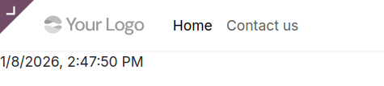
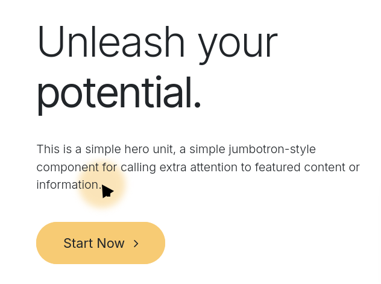
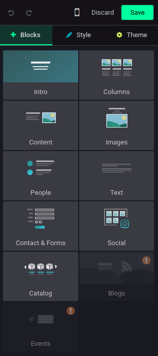
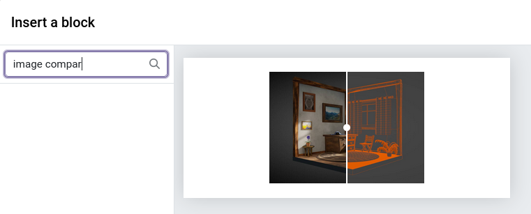

# Module 3: Learn the Website Framework

In this chapter, we will learn all about the website-related framework(s).

To understand the website codebase and how to hook yourself into it, you need to
take a few key factors into account:
- We make a website *builder*. That means that you should give the keys to the
user to design their site the way they intend: what can they drop on the page
and where? What can they change and how? What can they delete and how do they
re-add it? Not everything is customizable, but a lot is. That also means that
you cannot take a specific element, attribute or class as granted if there is
any way to move or get rid of them.
- The website module can be split into 2 scopes: there is the end-user-facing
frontend (let's call it the frontend), and there is the editor interface for the
website administrator or designer (let's call it the edit mode).

On the frontend, we use `Interactions` to inject dynamic behaviors with
JavaScript. Interactions are mostly independent from the OWL framework, but they
use some similar syntax.

In edit mode, we both supercharge the frontend interactions to add, remove or
alter some features, and we create *options* to give the keys to the designer.
Those options take full advantage of the HTML Builder framework, which relies on
OWL (for `OptionComponent`s) and on the HTML Editor's `Plugin`s.

But enough introduction, let's stop reading and start doing!
To get started, you need a running Odoo server and a development environment
setup. Before getting into the exercises, make sure you have a working setup.
Start your Odoo server with this repository in the addons path, then install the
`awesome_website` addon.

For this project, we will start with a very simple interaction, then create a
snippet (a block that is droppable on the page) and see how to work with it in
edit mode. Finally, we will create a more complex snippet with asynchronous
logic and services.

💡 **Tip**: we will be talking about several features. What is their respective
scopes?
- Interaction / Colibri => `/web` (used on the frontend: portal / website)
- Builder options => `/html_builder` (used by website and mass mailing)
- Edit interactions => `/website`
- Preview interactions => `/website`


## Content

- [Example of an interaction](#example-of-an-interaction)
- [1. Create an interaction](#1-create-an-interaction)
- [2. Create a cursor highlighter](#2-create-a-cursor-highlighter)
- [3. Create a before/after image snippet](#3-create-a-beforeafter-image-snippet)
- [4. Set up the before/after image interaction](#4-set-up-the-beforeafter-image-interaction)
- [5. Make an edit interaction](#5-make-an-edit-interaction)
- [6. Add builder options](#6-add-builder-options)
- [7. Use an OWL component](#7-use-an-owl-component)
- [8. Design a weather forecast snippet](#8-design-a-weather-forecast-snippet)
- [9. Consolidate your interaction with a service](#9-consolidate-your-interaction-with-a-service)
- [10. Add a test for your interaction](#10-add-a-test-for-your-interaction)
- [11. Add a test for your option](#11-add-a-test-for-your-option)

## Example of an interaction

What does an interaction look like?
It is a class that takes a `selector`, uses a life cycle (available methods are
`setup`, `willStart`, `start` and `destroy`), and attaches dynamic content
through the `dynamicContent` property, with available directives being `t-out`
(to output text or markup), `t-on-*` for events, `t-att-*` for attributes
(`t-att-class`, `t-att-style`, etc.) and `t-component` to attach a component.

```js
import { registry } from "@web/core/registry";
import { Interaction } from "@web/public/interaction";

export class MyCustomInteraction extends Interaction {
    static selector = ".my-selector";
    dynamicContent = {
        _root: {
            "t-out": () => this.weather.temperature,
            "t-att-style": () => ({
                "background-color": this.freezing ? "blue" : "yellow",
            }),
        },
        ".button": {
            "t-on-click": this.doSomething,
        }
    };

    setup() {
        this.freezing = false;
    }

    async willStart() {
        this.weather = await rpc("/awesome_website/weather");
        this.freezing = this.weather.temperature < 0;
    }

    doSomething() {
        console.log("Hello world");
    }
}

registry.category("public.interactions").add(
    "awesome_website.my_custom_interaction",
    MyCustomInteraction
);
```

Notice how the interaction is added to the `public.interactions` registry.

The `dynamicContent` directives are attached after `willStart` has resolved, and
are then recomputed every time an event is triggered (or through other
Interaction helpers).

💡 **Tips**:
- interactions can only be attached inside the `#wrapwrap` element (or within
the `body` if there is no `#wrapwrap`).
- Do you need a complex selector with `:has(*)` or `:not(:has(*))`? Use the
static properties `selectorHas` and `selectorNotHas` instead: as interactions
should work for end-users (as opposed to Odoo's customers), we cannot rely on
evergreen browsers and tend to code defensively.

💡 **Tip**: Have a look at the [Interaction](https://github.com/odoo/odoo/blob/19.0/addons/web/static/src/public/interaction.js)
base class file to dive deeper into the implementation details. As it is
thoroughly commented, this is a good starting point to have a better grasp on
how it works and what the available methods are.

## 1. Create an interaction

Let's start gently with an interaction that updates the content of the `<main>`
element with the current time.



1. Create the `Main` interaction inside
`awesome_website/static/src/interactions` and target the `<main>` tag.
2. Add a `dynamicContent` property. In our case, we can use the magic selector
`_root` to target the selector defined in the previous step, and output the
current date and time.
3. Add the file to the `web.assets_frontend` bundle in the manifest.
4. Open http://localhost:8069/ to see the result.

## 2. Create a cursor highlighter

Now that we have a basic understanding of the interactions, we can go a step
further. Let's enhance our awesome website with a cursor highlighter, a colored
dot that follows the user's cursor.



1. We are going to insert a new element on the page through the interaction. For
the selector, you can choose to focus the `#wrapwrap` directly.
2. In `setup()`, set up the variables that you will need: the x and y
coordinates and the new highlighter element (use the `.x_mouse_follower` class,
the styles are already ready).
3. In `start()`, append the highlighter. Look for the `insert()` method from the
`Interaction` class: it will automatically remove the element once the
interaction is destroyed. (This is also the reason why you need to append
elements in `start`: `destroy` is only called after an interaction has started.
If you added it in the `setup` and for some reason the interaction never
started, the element would not be removed.)
4. Now, for the magic to happen, we need to listen to the `pointermove` event
and track our cursor position.
5. You also need to adapt the highlighter's position. You could do that in the
handler of the `pointermove` event, but the position would not be cleaned on
destroy*. It is better to use the `dynamicContent` with the `t-att-style`
directive to achieve our goal! Everything that is done through the
`dynamicContent` will be reset upon destroy.

🤓☝️ *Well actually, given that the element itself will be cleaned up, it
doesn't matter. But keep in mind that it is good practice to apply your
modifications through the `dynamicContent` property!

💡 **Tip**: You want to debounce the `pointermove` event? Have a look at the
`debounced` method from the `Interaction` base class.

## 3. Create a before/after image snippet

Let's back up a little: we know how to attach interactions to existing elements,
and this is more than enough for plenty of things that you would want to do both
in the Website module and in modules with a dependency on the Portal module.
But you may have noticed that website pages work with building blocks (that we
call snippets): blocks that you can drag and drop in edit mode onto your page,
and that you can edit with options afterwards.

How can you create a new snippet from scratch and make it available for website
designers?

Snippet templates are defined in `/views/snippets` as XML files: those are QWeb
templates, processed by the server.

We are not going to cover all the possibilities offered by QWeb templates, let's
use a standard structure. Open the file `s_image_comparison.xml` and insert your
HTML structure for the before/after image snippet.

<details>
    <summary>Check your code against the example</summary>

    ```xml
    <section class="s_image_comparison pb64 pt64">
        <div class="o_container_small">
            <div class="o_image_comparison_container position-relative d-grid overflow-hidden">
                
                
                <input type="range" min="0" max="100" class="o_image_comparison_slider position-absolute"/>
                <div class="o_image_comparison_handle position-absolute top-50 translate-middle rounded-circle pe-none"/>
            </div>
        </div>
    </section>
    ```

    💡 **Tips**: Notice that we use a `<section>` tag: this is necessary if you want to add a
    block snippet, and it will give you a few default options in edit mode. On the
    contrary, if you only want to add an _inner snippet_ (a snippet that you can add
    inside any other block), you don't necessarily need the `<section>`.

</details>


A stylesheet is defined in `/static/src/snippets/s_image_comparison/000.scss`,
but it does not work for now. You need to register the asset through the XML
view like so:

```xml
<asset id="awesome_website.s_image_comparison_000_scss" name="Image Comparison 000 SCSS">
    <bundle>web.assets_frontend</bundle>
    <path>awesome_website/static/src/snippets/s_image_comparison/000.scss</path>
</asset>
```

💡 **Tips**: Why "000"? That is a versioning system so that we do not break
existing customers websites if we want to introduce breaking changes. A complete
revamp of the styles would then be called `001.scss`.
We also have some `000.xml` for templates called throughout the life of the
interaction.

Finally, you must add your snippet XML in the manifest, among the `data` files.

The new snippet is ready, but you still cannot use it: you have to add it to a
snippet category so that it appears when a user opens the snippet dialog.

> *The snippets categories as they appear on the interface*
>
> 

All snippet categories are defined in `website/views/snippets/snippets.xml`. If
you are adding a snippet directly in the website module, you can edit that file.
If, like in our `awesome_website` case here, you need to add it from another
module, you can simple xpath your way into it.
Have a look at the original website file to understand the syntax.

For our `s_image_comparison` snippet, I think the "Images" category would be a
perfect fit. Create a `snippets.xml` file and write your xpath.
For demo purposes, let's add the snippet preview in the 1st place, just before
`website.s_picture`. Feel free to add as many **keywords** as you wish: those
keywords are used to search for a snippet in the snippets dialog.

> *Searching for the snippet*
>
> 

<details>
    <summary>Unfold to see the full xpath</summary>

    ```xml
    <template id="snippets" inherit_id="website.snippets">
    <xpath expr="//t[@t-snippet='website.s_picture']" position="before">
        <t t-snippet="awesome_website.s_image_comparison" string="Image Comparison" group="images">
            <keywords>image comparison, before, after, compare, side-by-side, photo, picture, contrast, split, match, slider</keywords>
        </t>
    </xpath>
    </template>
    ```

</details>

To confirm that it works, open your website homepage in edit mode, drag or click
on the "Images" category and select the image comparison block.

## 4. Set up the before/after image interaction

Now that we have the snippet, we can create its interaction. By convention, we
add it in the same folder as the `000.scss`.

If you have a similar structure to what I suggested earlier, this is going to be
a simple interaction: you just need to listen for the slider `input` event and
update the `--slider-position` CSS custom property.

Once your interaction is running, you will see that it doesn't work in edit
mode. That's normal: we have a separate registry category for edit interactions.
If you want exactly the same behavior for the interaction in edit mode as on the
frontend, just add it to the `public.interactions.edit` registry:

```js
registry.category("public.interactions.edit").add("awesome_website.image_comparison", {
    Interaction: ImageComparison,
});
```

💡 **Tip**: It's not working? Did you add your file to the manifest?

## 5. Make an edit interaction

What if you want to tweak the interaction in edit mode? Maybe you want to
prevent an event from firing but still keep some parts of the interaction. Or
maybe you need to add some features on top of the public ones. We've got you
covered.

Because in most cases an edit interaction derives from a public interaction, and
the public interaction could itself extend another interaction (which could have
its own edit interaction), edit interactions overrides are written as
**mixins**. That allows the builder to apply all the overrides.

<details>
    <summary>❓ It's not clear</summary>

    | Public          | Edit               |
    | --------------- | ------------------ |
    | Foo             | FooEdit (override) |
    | Bar extends Foo | BarEdit (override) |

    Where `Bar` applies on `.element`.
    When you edit the page, if `.element` is on the page, it will apply both
    `FooEdit` and `BarEdit` on `Bar`, in that order.

    **Why not extensions?**

    If we had used extends, it would not have been possible to apply both
    overrides without copying code.

</details>

Here, for the sake of this demo, we consider that we don't want the slider to be
actionable in edit*. Create `image_comparison.edit.js` and override your public
interaction!

🤓☝️ *Well actually, this could be achieved by disabling the interaction
altogether. But for the sake of the exercise, let's imagine there are other
features that we want to keep.

Don't forget to add your mixin to the edit interactions registry category, and
remove that same line from the base interaction file.

```js
registry.category("public.interactions.edit").add("awesome_website.image_comparison", {
    Interaction: ImageComparison,
    mixin: ImageComparisonEdit,
});
```

To completely block the slider, we should also set `pointer-events: none`,
otherwise you can still move the slider thumb. You can either add the Bootstrap
class `.pe-none` through the edit interaction, or add the rule to the file
`000.edit.scss`.

💡 **Tip**: the file is already set to override the input's style. That allows
to click on the images to replace them and have access to all the standard image
options. Comment out the CSS rules to see the difference.

You must add the edit files to the `website.assets_inside_builder_iframe`
bundle.

```py
'website.assets_inside_builder_iframe': [
    'awesome_website/static/src/snippets/**/*.edit.*'
],
```


💡 **Tip**: overriding `dynamicContent` in edit interactions
- Unless that is exactly what you want, do not override the whole
`dynamicContent`! Always keep a copy of the original with
`dynamicContent = { ...this.dynamicContent, { ... } }`, or with
`patchDynamicContent` (in the setup).
Prefer `patchDynamicContent` if you add or override an entry of a selector whose
other entries you want to keep.


💡 **Tip**: When are interactions restarted in edition?
- Through `getConfigurationSnapshot`, the `websiteEditService`'s patch on
`Interaction` restarts an interaction if it detects a change in the `dataset` or
in the style of the interaction root element.
- If you have any other modification (class, child...), it won't restart the
interaction. This is to avoid stopping and restarting every interaction all the
time.
- Then `shouldStop` returns `true` if the snapshot returned was different from
what it used to be, or if `isImpactedBy` returns `true` (by default it always
returns `false`)

    If you do need to override that default behavior, you have 3 tools
    available:

    - override `getConfigurationSnapshot` (you can check existing
    implementations, e.g. on `DynamicSnippetCarouselEdit`)
    - override `isImpactedBy`, typically if you should restart depending on a
    child (present or not), or possibly depending on a class. Note that if you
    check if a class is present in `isImpactedBy`, the interaction will always
    restart if the class is present. If you need to restart only when the class
    is toggled, you should use `getConfigurationSnapshot`.
    - override `shouldStop`. The most common override on that one is to return
    `true` all the time, if all your options should trigger a restart of the
    interaction. Note that it does mean it will restart *all* the time, so try
    the other solutions first if they're not too heavy.

## 5bis. Make a preview interaction

This part is completely website-specific: when you drop a section snippet on a
website page (or an HTML field), it opens the snippets preview dialog.

There might be cases when you want the preview to look a very specific way or
have a limited behavior (compared to its actual, full behavior). Typically, if
the actual interaction implements a behavior when the user scrolls the page or
when they click on a button (e.g. carousels), you may want to show a similar
behavior on hover and on focus of the preview.

💡 **Tip**: when you add `:hover` rules, always consider whether you should also
add `:focus-visible` to account for keyboard accessibility.

By convention, we suffix those files (`.js`, `.scss`) with `*.preview.*`.

SCSS preview files must be registered in the manifest, in the
`html_builder.iframe_add_dialog` bundle.

JS preview interactions are, just like edit interactions, mixins and must be
registered through the registry, in the category `public.interactions.preview`.

️📃 In the case of our comparing slider, we could for instance add an animation
on hover to move the slider to the left and to the right.

## 6. Add builder options

What we have been calling the "edit mode" since the beginning of this tutorial
actually depends on the html_builder module. What it does is embedding the
frontend in an iframe, and rendering options around it (or sometimes on top of
it, e.g. the editor toolbar when you select some text).

You probably already saw that you have some default options available when you
click on your snippet. If you paid attention earlier, you remember that we used
a `<section>` to build our snippet: those default options are the ones that
appear when the current target is a section.

While interactions are temporary and reset on page load, options apply permanent
changes that will be saved in the DOM, or sometimes in the database.

Those options are defined as OWL templates with a set of Builder components
(`BuilderRow`, `BuilderButton`, `BuilderTextInput`, `BuilderColorPicker`, etc.).
Each individual option is a `BuilderRow` encapsulating one or several other
component(s).

Those options take an `action` as prop, with optionally some `actionParams` or/
and some `actionValue`. Actions are defined in JavaScript and extend
`BuilderAction`.

💡 **Tip**: 4 shorthand actions are available: `classAction`, `styleAction`,
`attributeAction` and `dataAttributeAction`. Have a look in the codebase to see
how they're used!

💡 **Tip**: some complex actions may require a deep dive into the way
`BuilderAction` works. Have a look at its implementation in
`addons/html_builder/static/src/core/builder_action.js`: it is heavily
commented / documented.

A plain example would be a checkbox to turn a class on or off:

```xml
<t t-name="awesome_website.MyToggleOption">
    <BuilderRow label.translate="Toggle Class">
        <BuilderCheckbox classAction="'my-toggled-class'"/>
    </BuilderRow>
</t>
```

To register the option, you then have to xpath the option into the builder
options at the place you want it to appear. If you need to add custom logic, you
can create a `Plugin` and potentially a custom `BuilderAction`.

```xml
<t t-inherit="website.BuilderOptions" t-inherit-mode="extension">
    <xpath expr="//t[@id='snippet_specific_options']" position="after">
        <my_toggle_option
            template="awesome_website.MyToggleOption"
            selector=".my-element"
            exclude=".my-exclude"/>
    </xpath>
</t>
```

If you need a custom action, you should update the option template:
```xml
<BuilderCheckbox action="'myToggleAction'" actionParams="'my-param'"/>
```


```js
class MyToggleOptionPlugin extends Plugin {
    static id = "awesome_website.MyToggle";

    resources = {
        builder_actions: { MyToggleAction },
    };
}

class MyToggleAction extends BuilderAction {
        static id = "myToggleAction";
        apply({ editingElement, params: { mainParam }}) {
            ...
            // Handle mainParam (=== "my-param")
        }
}

registry.category("website-plugins").add(MyToggleOptionPlugin.id, MyToggleOptionPlugin);
```

<details>
    <summary>More complex options that rely on a state can also extend
    `BaseOptionComponent`, but this is not necessary here.</summary>

    ```js
    export class MyToggleOption extends BaseOptionComponent {
        static id = "my_toggle_option"; // Matches the XML tag name
        static template = "awesome_website.MyToggleOption"

        setup() {
            super.setup();
            this.state = useDomState((editingElement) => {
                // handle state
            });
            // custom logic
        };
    }

    registry.category("website-options").add(MyToggleOption.id, MyToggleOption);
    ```
</details>


️📃 Now it's your turn. Which options do we need for our snippet to shine? Choose
one or two and try to make them work. Here are some ideas:

- Choose between vertical and horizontal slide
- Add before / after labels
- Change the appearance of the corners (rounded, squared, cut...)
- Set the default value of the slider on some other value (25%, 75%...)
- Change the color of the handle
- Adapt the handle size
- Set a different icon on the slider handle
- ...

## 7. Use an OWL component

If you need some reusable component and you do not care about it being editable,
you may want to use an OWL component. You can do that very easily in 2 ways:

- through the Interaction's `t-component` directive.
- with an `<owl-component>` custom element.

The syntax for `t-component` is: `"t-component": () => [Comp, { ...props }]`,
where the props are optional.

To be able to use `<owl-component>`, you first have to register your component
in the `public_components` registry category. The element takes a `name` (the
one you gave in the registry) and a `props` attribute, which should be formatted
in JSON.

⚠️ **Important**: these are valid approaches especially outside of the
boundaries of the HTML builder. But as soon as your component is available on
the builder, you should absolutely ask yourself whether an OWL component is
really the way to go! Your component will not be editable, you will not have
many ways to add website builder options on it, the end user will not have any
editing right on the text within it... There are always exceptions, but it is
generally a bad idea.

️📃 Create a basic component with one or two props, and call it through an
interaction, then using `<owl-component>`.

## 8. Design a weather forecast snippet

## 9. Consolidate your interaction with a service

## 10. Add a test for your interaction

## 11. Add a test for your option
